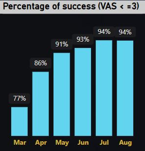
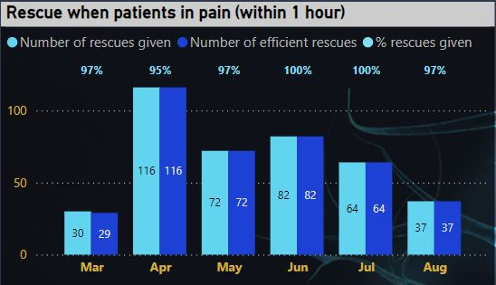
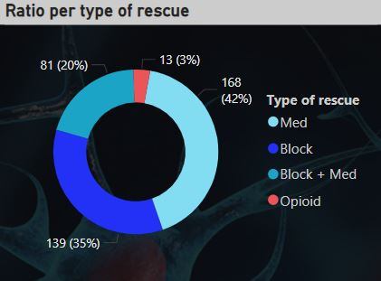
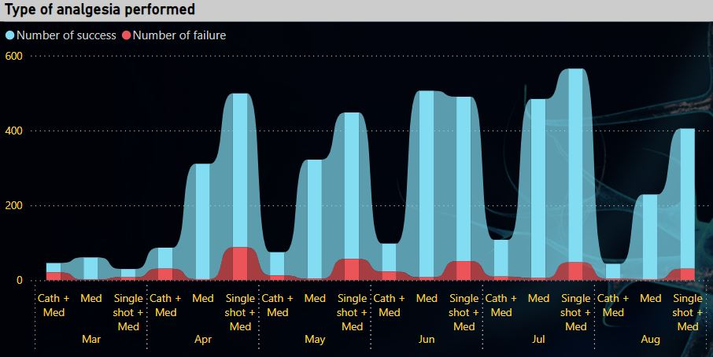
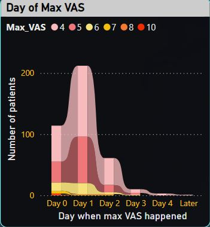
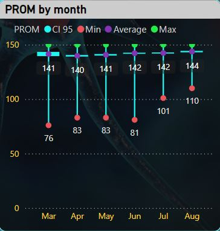
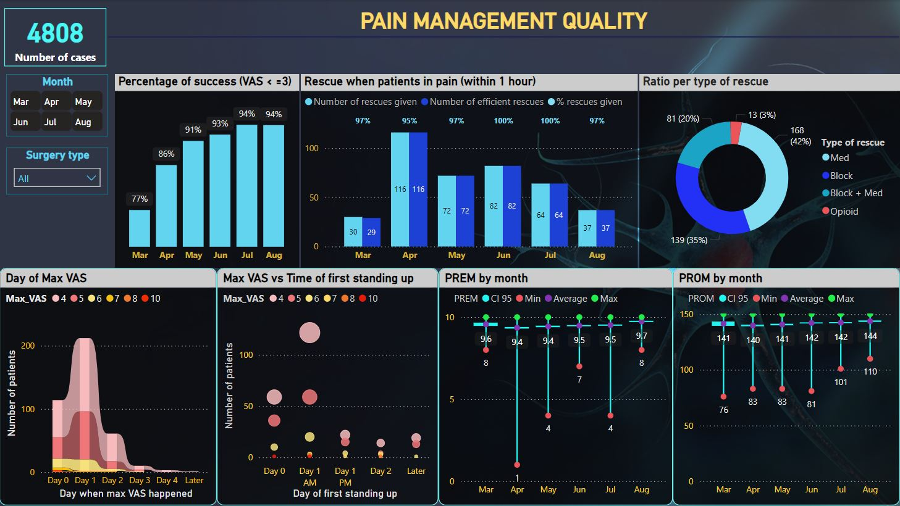

# Introduction
These are data on pain control quality from a hospital, collected by nurses, evaluated by patients before hospital discharge from Feb to Aug 2023. 
This project is to analyse post-op pain management quality of the hospital and identify their issues for corrective actions.

SQL queries? Check them out here: [pope.sql](/SQL_P1_Pain_management/Pope.sql)

### Questions to answer:
1. What is the percentage of cases with no pain or mild pain (VAS ≤ 3)?
2. In case of pain (VAS >3), do patients receive response from medical staff for pain relief? What is the number of successful rescues? 
3. What is the ratio of rescue per type?
4. What is the number of success and failure by type of analgesia?
5. When do patients usually have pain?
6. What is the correlation between pain and first standing up time?
7. What is the PROMS score by month?

# Tools I used
- **SQL**
- **SQL server**
- **Power BI**
- **Visual Studio Code**
- **Git & Github**

# Analysis
Each query for this project aimet at investigating specific aspects of pain management quality.
Here is how I approach each question:
### 1. Overall successful rate of pain free / mild pain surgeries 
To identify this ratio, I counted the number of cases having highest VAS ≤ 3 (pain scale) and total of surgical cases by month.

```sql
SELECT 
    month(date_of_surgery) as Month_num ,
    FORMAT(date_of_surgery,'MMM') as Month,
	COUNT(*) total,
    SUM(CASE WHEN max_vas IS NULL THEN 1 ELSE 0 END) AS 'success_case',
	COUNT(*) - SUM(CASE WHEN max_vas IS NULL THEN 1 ELSE 0 END) as 'need_rescue'
FROM po1
GROUP BY month(date_of_surgery), FORMAT(date_of_surgery,'MMM');
```
Quick insight:
Overall, the success rate is > 80%. 
Feb has the lowest rate because of the data sample. Data collection was only within the final week of Feb 2023.




*Column graph shows successful rate of pain free/mild pain surgeries by month).*

### 2. Percentage of pain response when patients report to have pain.
To find out if patients receive timely response from medical staff to control the pain.

```sql
WITH rescue_sub AS (
    SELECT 
        MONTH(date_of_surgery) as Month_num, 
        FORMAT(date_of_surgery,'MMM') as "Month",  
        PID, max_vas, 
        Type_of_rescue, 
        Efficient_within_1h,
    CASE
      WHEN Type_of_Rescue IS  NOT NULL THEN 1 ELSE 0 END as 'rescue_available',
    CASE 
        WHEN Type_of_Rescue IS NULL THEN 1 ELSE 0 END as 'no_rescue_given',
    CASE 
        WHEN Efficient_within_1h = 1 THEN 1 ELSE 0 END as "successful_rescue"
FROM po1
WHERE MAX_VAS > 3)

SELECT 
    month_num, month, 
    COUNT (max_vas) as total_pain_case,     
	SUM(no_rescue_given) as total_no_rescue_given,
	SUM(rescue_available) as total_rescue_done,
	SUM(successful_rescue) as num_successful_rescue,
	SUM(rescue_available) - SUM(successful_rescue) as num_failed_rescue
FROM rescue_sub
GROUP BY month_num, month;
```
Here is the percentage of patients having efficient pain control within 1 hour since the notification.
On average, over 90% of patients have pain response from medical staff. 95% of these responses are effective.
For the other 10% that don't receive pain response, these data were missing.




### 3. Ratio per type of rescue
This query helped identified the distribution of pain rescue methods when patients have pain.

```sql
SELECT 
    MONTH(Date_of_Surgery) as Month_num, 
    FORMAT(Date_of_Surgery,'MMM') as Month, 
    Type_of_Rescue, 
    COUNT(*) as num_rescue
FROM po1
WHERE Type_of_Rescue IS NOT NULL
GROUP BY month(Date_of_Surgery), FORMAT(Date_of_Surgery,'MMM'), Type_of_Rescue;
```

Here is the breakdown of pain rescue distribution:
- Most patients receive regional anesthesia and pain killer. 
- Only in some rare cases, patients need opioid rescue. This can be due to complex pain syndrome (cancer patients), difficult techniques to perform or poor follow up/ organisation.



*The pie chart shows the ratio of pain rescue method from Feb to Aug 2023.*

### 4.1. Overall successful rate at first attempt per type of analgesia
Based on the field of what analgesia technique used for each case, I used CASE function to group into 4 categories: Single shot, Catheter, Combined single shot and catheter and No RA (no single shot nor catheter)
```sql
WITH type_of_analgesia AS
(SELECT 
    PID, date_of_surgery, catheter, singleshot,
    CASE 
        WHEN catheter IS NULL AND singleshot IS NOT NULL THEN 'Single shot' 
        WHEN catheter IS NOT NULL AND singleshot IS NULL THEN 'Catheter'
	    WHEN catheter IS NULL AND singleshot IS NULL THEN 'No RA' 
	    ELSE 'Combine' END as Analgesia_type,
    CASE 
        WHEN max_vas <= 3 OR max_vas IS NULL THEN 1 ELSE 0 END AS 'success'
FROM po1)

SELECT 
    MONTH(Date_of_Surgery) as Month_num, 
    FORMAT(date_of_surgery,'MMM') as Month, Analgesia_type,
    COUNT(*) as total,
	SUM(success) as "total_success",
	COUNT(*) - SUM(success)  as "total_failure"
FROM type_of_analgesia
GROUP BY month(Date_of_Surgery), FORMAT(date_of_surgery,'MMM'),  Analgesia_type;
```
Here what I found:
* The total number of cases from most to least every month:
no regional anesthesia > singleshot > catheter > combined single shot and catheter.
* Combined single shot and catheter, and catehter have many failures.
Question to investigate more:
* Why are the failures of Combined regional anesthesia and catheter that high?
* Why does catheter have the lowest number of indication?




### 5. Frequent time of rebound pain
Exploring what day after surgery that patients often have pain back.

```sql
SELECT 
    month(Date_of_Surgery) as Month_num, 
    FORMAT(Date_of_Surgery,'MMM') as "Month", 
    day_of_max_pain, 
    COUNT(*) / (SELECT CAST( COUNT(*) AS NUMERIC(4,2))
						FROM po1
						WHERE MAX_VAS >5) as "%frequency"
FROM po1
WHERE max_vas > 5 AND Day_of_max_pain IS NOT NULL
GROUP BY month(Date_of_Surgery), FORMAT(Date_of_Surgery,'MMM'), day_of_max_pain;
```
Quick insight:
- After surgery, the vast majority of patients have rebound pain on the same day of surgery (Day 0) and the next day (Day 1)
- Some cases have pain 2 or 3 days later.
- After 4 days, no patient reports to have pain. 



*The column chart visualizes the time when patients report to have pain back after surgery (from Feb to Aug 2023).*

### 6. What is the correlation between pain and first standing up time?

- Most patients have very early mobility, on Day 0 and in the morning of Day 1. 
- Question to investigate furthur: why some patients have delayed mobility?


*Scatter chart represents the correlation of pain level and time of mobility of patients having surgeries between Feb and Aug 2023.*


### 7. Patient outcome (QOR-15)

To show the average score given by patients about PROMs (Patient-reported outcome measures) and the 95% confidence interval, I used Power BI to visualize the trend as below:



It shows that most patients are happy about their outcomes, with an average score of 140/150 and very tight 95% confidence interval.

# What I learned
- SQL Aggregation, CASE, CTE
- Analytical approach
- Power BI visualization

# Conclusion
### Insights:
From the analysis, here is the actual situation of the hospital in terms of pain management quality:
1. **Rate of pain free or mild pain surgeries:** ~ 80% of patients don't have pain after surgeries
2. **Pain response:** ~ 85% of patients with pain received efficient pain relief within 1 hour.
3. **Ratio of pain rescue method:** regional anesthesia and pain medication are primarily used. Only a few cases required opioid.
4. **Analgesia method:** top 1 method are medication and none regional anesthesia, followed by combined regional anesthesia (single shot and catheter). However, there are many failures in regional anesthesia technique.
5. **Time of rebound pain:**  Mostly on the same day and the next day 
6. **8Pain and the first standing up time:** most patients have early mobility (on Day 0 and Day 1 morning)
7. **Patient outcome measurement:** Most patients report to have good outcome (on average 140/150)

### Closing thoughts:
This project helps me see the actual quality of pain control for patients undergoing surgeries from Feb to Aug 2023.
Even though the quality is good on average, there are issues to investigate further to build an action plan:
- Some data missing for pain rescue. The nurses need to pay more attention in collecting these data. If needed, need to review the medical records to look for these missing data.
- Further investigation is needed to find out:
    -  Why some patients need opiod for pain relief.
    -  Why do many cases with regional anesthesia techniques failed? Why is catheter not indicated the least? Is it due to technique difficulties that anesthesiologists encounter? Any techniques require re-training?...
    - Why some patients have delayed mobility?
    - Why some patients have poor outcome? This can be related to failure of rescue? failed technique? Complex pain syndrome, for instance, in cancer patient?,...

Below is the dashboard I built on Power BI to present data insight to the hospital management.
    