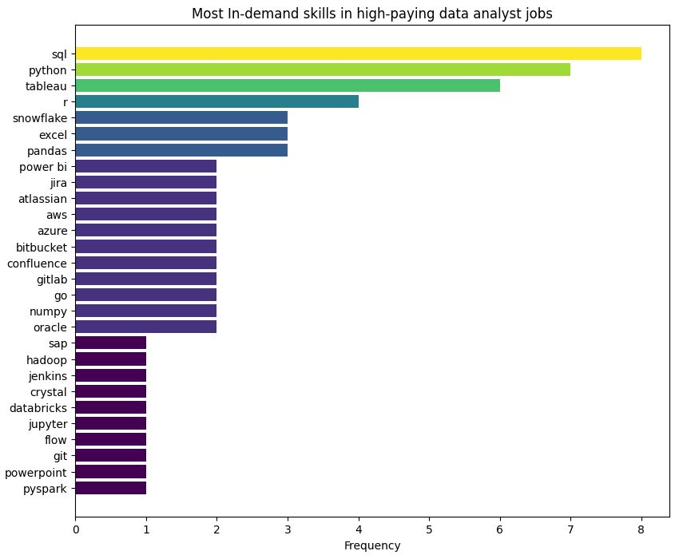
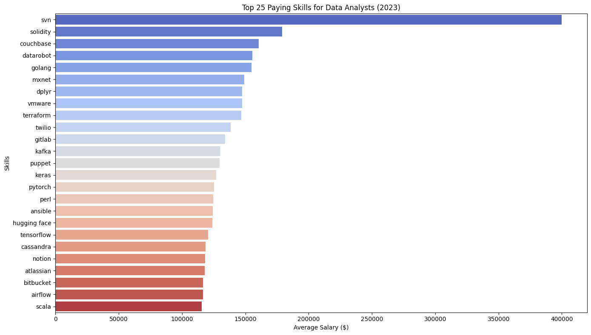

# Introduction
First insight into the job markets of data analysts.
This project explores top-paying jobs, in-demand skills and where high demand meets high salary in data analysis.

SQL queries? Check them out here: [Analysis](/SQL_P3_Jobs/Analysis.sql)

# Background
Project to start data analysis to navigate the market more effectively
Data collected in 2023.
### Questions to answer:
1. What are the top-paying data analyst jobs?
2. What skills are required for these top paying jobs?
3. What skills are most in demand for data analysts?
4. What are most optimal skills to learn?

# Tools I used
- **SQL**
- **SQL server**
- **Visual Studio Code**
- **Git & Github**

# Analysis
Each query for this project aimet at investigating specific aspects of data analyst job market.
Here is how I approach each question:
### 1. Top paying data analyst job
To identify the highest paying jobs. I filtered data analyst postions by average yearly salary and location, focusing on remote jobs. This highlight the top paying opportunities for data analyst job seekers.
```sql
SELECT TOP(10)
        name as company_name,
        job_id,
        job_title,
        job_location,
        job_schedule_type,
        salary_year_avg,
        job_posted_date
FROM
        job_postings_fact
LEFT JOIN company_dim
ON company_dim.company_id = job_postings_fact.company_id
WHERE
        job_title_short = 'data analyst' AND job_location = 'anywhere'
        AND salary_year_avg IS NOT NULL
ORDER BY salary_year_avg DESC;
```
Here is the breakdown of the top data analyst jobs in 2023:
- **Wide salary range:** Top 10 range from $184,000 to $650,000 which indicates significant salary potential in the field.
- **Diverse employer:** Companies like SmartAsset, Meta, AT&T are among those offering the highest salaries, showing a broad interest across different industries.
- **Job title variety:** High diversity in job titles, from Data Analyst to Director of Analytics, reflecting varied roles within data analytics.


*Bar graph shows the salary for the top 10 salaries for data analysts (generated by ChatGPT from my SQL query results)*

### 2. Skills required for top-paying roles
To understand what specific skills are required the most, I joined the job postings table with the skills table.
```sql
WITH top_10 AS (
SELECT TOP(10)
        name as company_name,
        job_id,
        job_title,
        salary_year_avg
FROM
        job_postings_fact
LEFT JOIN company_dim
ON company_dim.company_id = job_postings_fact.company_id
WHERE
        job_title_short = 'data analyst' AND job_location = 'anywhere'
        AND salary_year_avg IS NOT NULL
ORDER BY salary_year_avg DESC
)

SELECT top_10.*,
        skills
FROM top_10
JOIN skills_job_dim sk
ON sk.job_id = top_10.job_id
JOIN skills_dim 
ON skills_dim.skill_id = sk.skill_id
ORDER BY salary_year_avg DESC;
```
Quick snapshot based on the result:
* SQL is leading, then Python follows closely.
* Tableau is also highly sought after.
* Other skills like R, Snowflake, Pandas, Excel show varying degrees of demand.


*Bar chart generated by ChatGPT based on my SQL query result*

### 3. In-demand skills for Data analysts
This query helped identified the skills most frequently required in job postings.
```sql
SELECT top (5) 
    skills,
    COUNT(sk.job_id) AS demand_count
FROM job_postings_fact as fact
JOIN skills_job_dim sk
ON sk.job_id = fact.job_id
JOIN skills_dim 
ON skills_dim.skill_id = sk.skill_id
WHERE job_title_short = 'Data analyst' AND job_work_from_home = 1
GROUP BY skills
ORDER BY 2 DESC
```
Here is the breakdown of most demanded skills in 2023:
* SQL and Excel are fundamental, emphasizing the importance of strong foundational skills in data processing and manipulation.
* Programming and Visualization tools like Python, Tableau and Power BI are essential showing the importance of technical skills in data storytelling.

| Skills     | Demand Count |
|------------|--------------|
| SQL        | 7291         |
| Excel      | 4611         |
| Python     | 4330         |
| Tableau    | 3745         |
| Power BI   | 2609         |

*Table of demand for top 5 skills in data analyst job postings (remote)*

### 4. Most optinal skills to have
Exploring the average yearly salaries associated with different skills revealed which skills have the highest paying.
```sql
SELECT TOP(25)
    skills,
    ROUND(AVG(salary_year_avg),0) as avg_salary
FROM job_postings_fact as fact
JOIN skills_job_dim sk
ON sk.job_id = fact.job_id
JOIN skills_dim 
ON skills_dim.skill_id = sk.skill_id
WHERE job_title_short = 'Data analyst' AND salary_year_avg IS NOT NULL
GROUP BY skills
ORDER BY 2 DESC
```
Quick insight:
- **Niche and Emerging Technologies Pay the Most:** Skills in SVN, Solidity, and Couchbase lead the top paying list, indicating high demand for expertise in specialized and emerging technologies.
- **Machine Learning and DevOps Skills Are Highly Valued:** Proficiency in machine learning frameworks (e.g., MXNet, Keras) and DevOps tools (e.g., VMware, Terraform) commands high salaries, reflecting their critical role in data analytics.
- **Diverse Skill Set Needed for High Pay:** A mix of programming languages (e.g., Golang, Scala), database management (e.g., Cassandra), and version control/collaboration tools (e.g., GitLab, Bitbucket) highlights the broad range of skills that contribute to higher earnings in data analyst roles.



# What I learned
- SQL Join function, Aggregation, CTE
- Analyticsl approach

# Conclusion
### Insights:
From the analysis, several general insights emerged:
1. **Top Paying Data Analyst Job:** The salary for a remote position can go up to $650,000
2. **Skills for Top Paying Jobs:** Advanced proficiency in SQL, suggesting this is a critical skills
3. **Most in-demand Skills:** SQL
4. **Optimal Skills for Job Market Value:** SQL leads in demand and helps to get a high average salary which indicates this is the most optimal skill to learn to maximize market value for data analysts.

### Closing thoughts:
This project enhanced my SQL skills and provided valuable insights into the data analyst job market. The finding from the analysis serve as a guide to prioritize skills development. By focusing on high demanded skills, a motivated data analyst can become very competitive and yield high value in this field.